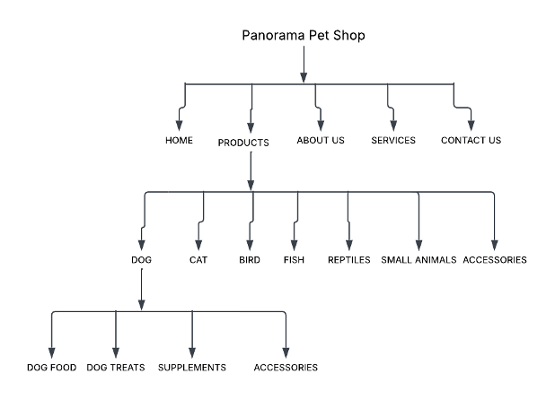

# Panorama_Website

## Student Information
* Student Name: Zusange Mbaleki
* Course: Higher Certificate in Mobile Application and Web Development
* Institution:  Rosebank International
* Project:  Panorama Pet Shop Website

## Project Overview
Panorama Pet Shop is a responsive pet shop website redesign created created for a local pet shop in Parow, Cape Town.The website was designed to provide customers with an easy way to learn about the business, browse available pet products, view services and contact the shop.
The website includes the following pages:
* Home - Introduces Panorama Pet Shop and provides access to the main areas of the website.
* About Us - Provides information about the business and its purpose.
* Products - Organises pet products into different categories, including Dogs, Cats, Birds, Fish, Small Animals, and Accessories.
* Services - Displays the services offered by the pet shop.
* Contact Us - Provides customers with contact and enquiry information.

The website was developed using HTML, CSS, and JavaScript. The design uses an emerald green, coral orange, cream, soft gray, and charcoal colour palette to create a consistent visual identity throughout the website.
The project also includes organised product imagery, category navigation, interactive elements, and responsive design features to improve the overall user experience.

## Website Goals and Objectives
- Improve the website's desktop layout
- Provide clear and intuitive navigation
- Organise products into clear categories
- Provide customers with useful business information
- Improve the overall user experience

## Key Features and Functionality
- Home page
- About Us page
- Products page
- Services page
- Contact page
- Product categories
- Search functionality
- Responsive design

## Timeline and Milestones
|Date	     |     Milestone  |
|--------------|-------------|
|30 July – 1 August|	Prepare and submit the website draft proposal for feedback and approval.|
|2 – 3 August      |	Review feedback and make any required changes to the proposal.|
|4 – 13 August     |	Develop the basic website structure using HTML.|
|14 August	       |Submit Part 1 (HTML website).|

## Part 1 Details- Project Planning
Part 1 focused on planning and researching the proposed website before development. It requires us to:
* Research and understand the chosen organisation and their existing website.
* Identifying the website's goals, objectives, and target users.
* Identify areas of improvement for the existing website.
* Define the website's required features and content.
* Create a sitemap showing the website's structure and page hierarchy.
* Develop a file and folder structure for the project.
* Create  low-fidelity wireframes for the main pages.
* Research and plan the content, products, and categories.
* Define the proposed design direction, including the colour palette and overall user experience.
* Identify the technical requirements for developing the website.
The Panorama Pet Shop proposal was developed based on these Part 1 requirements and was approved before development began.

## Sitemap
The sitemap below shows the structure and hierarchy of the Panorama Pet Shop website.

## Changelog
## 14 August 2026
* Changed the homepage pet image.
* Added project research to the README.
* Added the sitemap to the README.
* Added the project file and folder structure to the README.

## 13 August 2026
* Added the first half of the README.

## 12 August 2026
* Added images to the website and organised them according to their product categories.

## 10 August 2026
* Created the initial HTML pages and started the website structure.

## 15 September 2026
## Changes based on feedback
* Added alt text to images to improve accessibility.
* Added more category images as requested in the feedback.
* Added comments to the HTML and CSS code to make code easier to understand.
* Fixed the Sitemap image and made it visible.

## 16 September 2026
## New entries
* Added more products and organised them into categories.
* Improved the product card layout and spacing.
* Added hover effects to buttons, navigation links, and product cards.

## 17 September 2026
## New entries
* Improved the Contact Us page by increasing the message box size and updating the Submit button.
* Improved the Home page buttons and layout.
* Added responsive styling to improve the website on smaller screens.
* Updated the footer styling.
* Improved the overall consistency of the website’s colours, layout, and design.

## References
Host Africa, 2026. How much does it cost to build a website  in South Africa? (2026 Price Guide).[online] Available at:< https://hostafrica.co.za/blog/websites/website-basics/how-much-does-a-website-cost-in-south-africa/ > [Accessed on: 31 July 2026].
Interaction Design Foundation, [n.d.]. Interaction Design Foundation. [online] Available at: < https://www.interaction-design.org/ > [Accessed on: 30 July 2026].
Mozilla Developer Network (MDN), [n.d.]. CSS Reference. [online] Available at:<https://developer.mozilla.org/en-US/docs/Web/CSS/How_to/Layout_cookbook/Column_layouts> [Accessed on: 17 September 2026].
Smith R., 2017. Validating product Design ideas with low-fidelity wireframes. [online] Available at:<https://medium.com/@robertsmith_co/validating-your-product-design-ideas-with-low-fidelity-wireframes-fba03b84af23 > [Accessed on: 31 July 2026].
Panorama Pet Shop, [n.d.]. Panorama Pet Shop. [online] Available at: < https://panoramapetshop.co.za/product-category/reptiles/ >[Accessed on: 31 July 2026].
W3Schools, [n.d.]. CSS Tutorial. [online] Available at: <https://www.w3schools.com/css/> [Accessed on: 17 September 2026].

